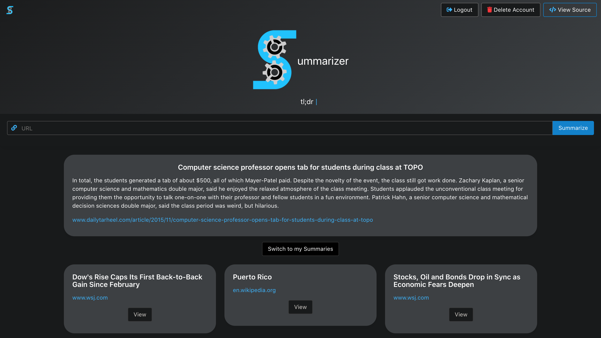

<h1 align="center">
  ummarizer
</h1>

---

Summarizer is a web application that allows a user to summarize any online text composition whether that be a news article or a story.

Time is of the essence to everyone. Shrinking the content in an online article by 75-99% can save users minutes or hours depending on how many articles they read in any given period. Many readers want a quick summary highlighting the main ideas and the conclusion of the composition.

There are also education and health benefits associated with shortening text and making the points of said text very evident. Many people have difficulty focusing for extended periods, and Summarizer can offset some of that difficulty.

## Setup / Installation

1. Download or clone this repository: `https://github.com/adamalston/Summarizer.git`
2. Run: `npm install`
3. Open a new shell in the comp426-backend directory
4. Start the server: `npm run dev-live-reload`
5. Open a new shell in the main project directory
6. Start the client: `npx browser-sync start -sw`

## Frontend

### Design

Summarizer is designed to be simple and intuitive. We anticipate many people will be using the app at night right before bedtime so it should also be easy on the eyes.

  

### Functionality

Summarizer starts by prompting you to sign up and login. Once done, you can start summarizing! Simply paste a URL into the textbox and press Summarize. A summary of the article will be generated and shown below. The app will then store the summary in a database for later viewing. You can choose to attach a note to the summary if you wish.

## Backend

Summarizer has a simple backend server that uses Express and data-store to act as a restful API.

A custom route to the API was implemented to eliminate CORS errors and ensure efficient storage in our backend. A side effect of this custom route is that it improves the overall security of our app.

For more info about the backend, see the [server readme](comp426-backend/README.md).

Enjoy!
